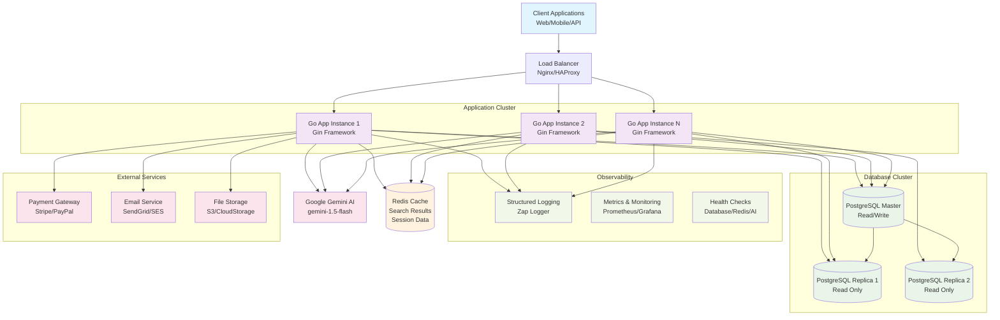
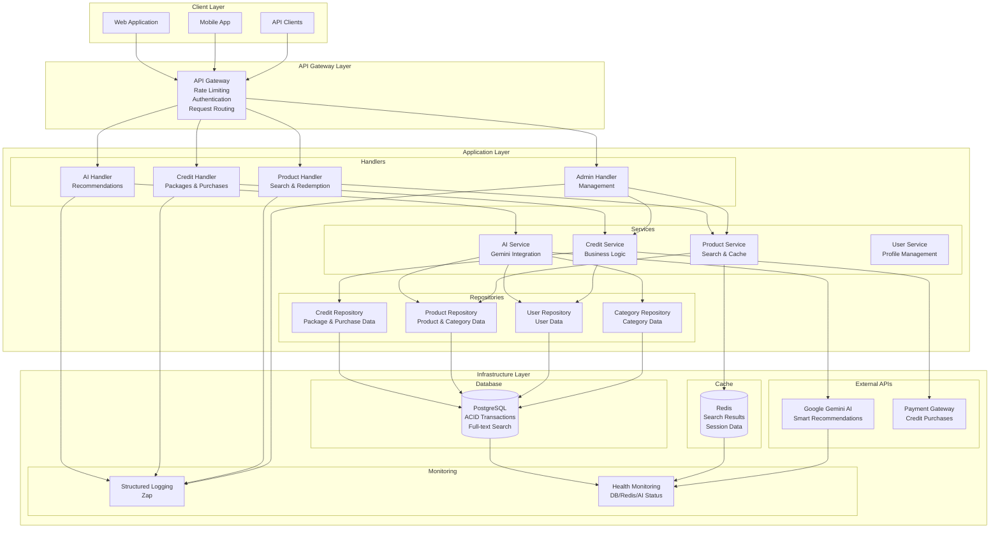
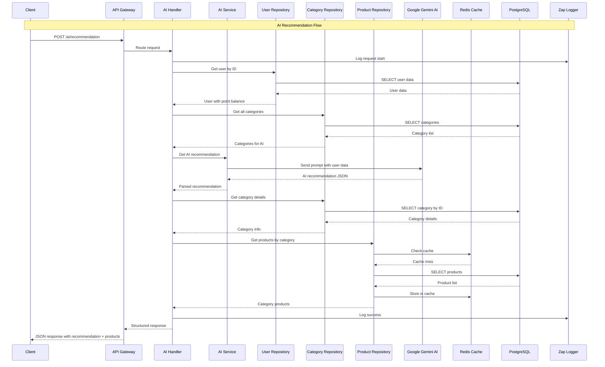
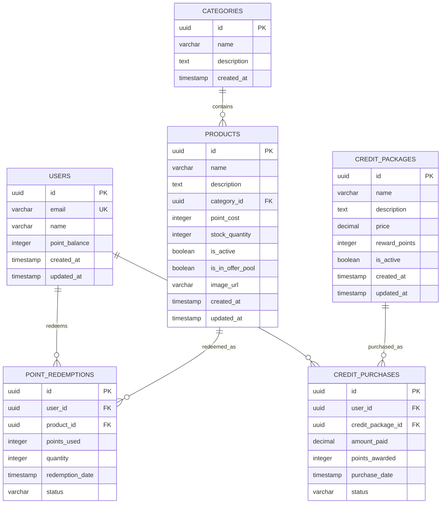

# 4sal Reward System - High-Level System Design

## System Architecture Overview



## Component Architecture



## Data Flow Architecture



## Database Schema Design



## Technology Stack

### Backend Framework
- **Language**: Go 1.22
- **Framework**: Gin (HTTP router)
- **Architecture**: Clean Architecture with layers

### Database & Storage
- **Primary Database**: PostgreSQL 15
  - ACID transactions
  - Full-text search with GIN indexes
  - Connection pooling
- **Cache**: Redis 7
  - Search result caching
  - Session storage
  - TTL-based expiration

### AI Integration
- **Provider**: Google Gemini 1.5 Flash
- **Use Case**: Smart product recommendations
- **Fallback**: Rule-based recommendations
- **Timeout**: 30 seconds with graceful degradation

### Infrastructure
- **Containerization**: Docker & Docker Compose
- **Logging**: Structured logging with Zap
- **Health Checks**: Database, Redis, and AI service monitoring
- **Environment**: Environment-based configuration

### External Integrations
- **AI**: Google Generative Language API
- **Future**: Payment gateways, email services, file storage

## Scalability Features

### Performance Optimizations
1. **Database Indexing**
   - GIN indexes for full-text search
   - B-tree indexes on foreign keys
   - Composite indexes for common queries

2. **Caching Strategy**
   - Redis for search results (5-minute TTL)
   - Cache invalidation on product updates
   - Connection pooling for database

3. **Horizontal Scaling**
   - Stateless application design
   - Load balancer ready
   - Database read replicas support

### Reliability Features
1. **Error Handling**
   - Structured error responses
   - Graceful degradation for AI failures
   - Comprehensive logging

2. **Health Monitoring**
   - Database connection health
   - Redis availability checks
   - AI service status monitoring

3. **Transaction Safety**
   - ACID transactions for critical operations
   - Optimistic locking for concurrent updates
   - Rollback mechanisms

## Security Considerations

### Current Implementation
- Input validation and sanitization
- SQL injection prevention
- Structured error handling without information leakage
- Environment-based configuration

### Production Recommendations
- JWT authentication
- API rate limiting
- HTTPS/TLS encryption
- API key management
- Request logging and monitoring
- Role-based access control (RBAC)

## Deployment Architecture

### Development Environment
```bash
docker-compose up --build
```

### Production Environment
- **Container Orchestration**: Kubernetes/Docker Swarm
- **Load Balancing**: Nginx/HAProxy
- **Database**: Managed PostgreSQL (AWS RDS/Google Cloud SQL)
- **Cache**: Managed Redis (AWS ElastiCache/Google Memorystore)
- **Monitoring**: Prometheus + Grafana
- **Logging**: ELK Stack or similar

### Scaling Strategy
1. **Horizontal Scaling**: Multiple application instances
2. **Database Scaling**: Read replicas for read-heavy operations
3. **Cache Scaling**: Redis cluster for high availability
4. **CDN**: Static asset delivery optimization
5. **Auto-scaling**: Based on CPU/memory metrics